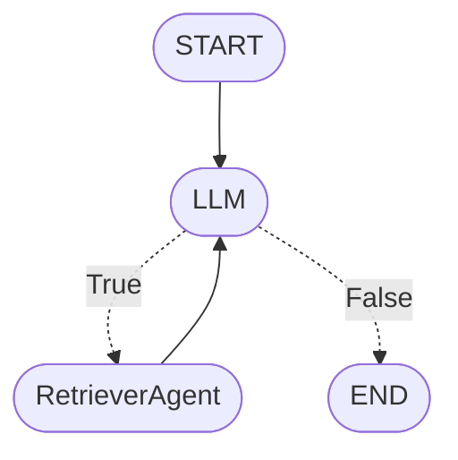

# AI Agent开发案例5 —— RAG

## 1. 目标

要实现RAG应用，其状态图如下所示：

```mermaid
flowchart TD
    START([START])
    LLM([LLM])
    RetrieverAgent([RetrieverAgent])
    END([END])

    START --> LLM
    LLM -. True .-> RetrieverAgent
    LLM -. False .-> END
    RetrieverAgent --> LLM
```