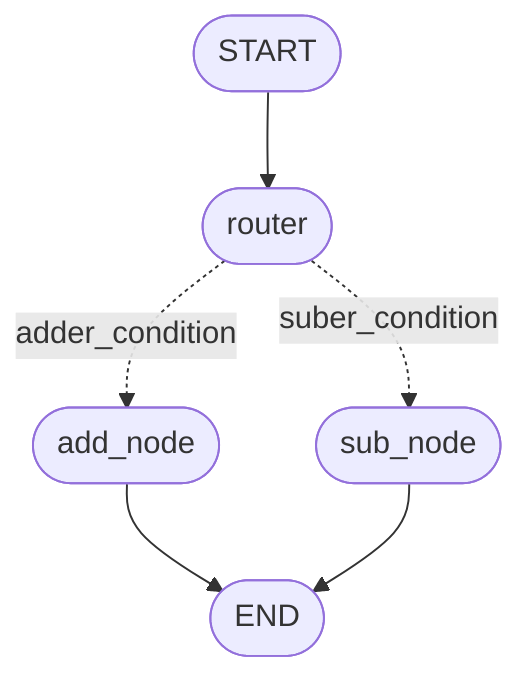

# Agent开发案例4

## 1. 目标
1. Implement conditional logic to route the flow of data to different nodes.

2. Use START and END nodes to manage entry and exit points explicitly.

3. Design multiple nodes to perform different operations (addition, subtraction).

4. Create a router node to handle decision-making and control graph flow.

核心目标：

1. How to use `add_conditional_edges()`

## 2. 实现

要实现这样的条件选择，需要往StateGraph中添加条件边。



```py
from typing import List, TypedDict
from langgraph.graph import StateGraph, START, END

class AgentState(TypedDict):
    num1: int
    num2: int
    operation: str
    final: int

def adder(state: AgentState) -> AgentState:
    state['final'] = state["num1"] + state["num2"]
    return state

def suber(state: AgentState) -> AgentState:
    state['final'] = state["num1"] - state["num2"]
    return state

def decide_nex_node(state: AgentState) -> AgentState:
    if state["operation"] == '+':
        return "adder_condition"
    elif state['operation'] == '-':
        return "suber_condition"

if __name__ == '__main__':
    graph = StateGraph(AgentState)
    graph.add_node("adder", adder)
    graph.add_node("suber", suber)
    graph.add_node("router", lambda state:state)

    graph.add_edge(START, "router")
    graph.add_conditional_edges(
        "router",
        decide_nex_node,
        {
            "adder_condition": "adder",
            "suber_condition": "suber"
        }
    )
    graph.add_edge("adder", END)
    graph.add_edge("suber", END)

    # 编译StateGraph
    app = graph.compile()

    # 运行
    result = app.invoke({
        "num1": 10,
        "num2": 20,
        "operation": "-"
    })
    print(result["final"])
```


总结：

- 往StateGraph中添加条件边

```py
def decide_nex_node(state: AgentState) -> AgentState:
    if state["operation"] == '+':
        return "adder_condition"
    elif state['operation'] == '-':
        return "suber_condition"

graph.add_conditional_edges(
    "router",
    decide_nex_node,
    {
        "adder_condition": "adder",
        "suber_condition": "suber"
    }
)
```

