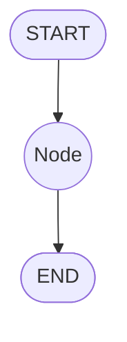

# Agent开发案例1

## 1. 介绍
实现一个非常简单的hello world graph如下所示：



## 2. 实现

```py
from typing import Dict, TypedDict
from langgraph.graph import StateGraph

class AgentState(TypedDict):
    message : str

def greeting_node(state: AgentState) -> AgentState:
    """Simple node that adds a greeting message to the state"""
    state['message'] = 'Hey ' + state['message'] + ", how is your day going?"
    return state

if __name__ == '__main__':
    graph = StateGraph(AgentState)
    graph.add_node("greeter", greeting_node)

    # 添加START和END节点
    graph.set_entry_point("greeter")
    graph.set_finish_point("greeter")

    # 编译StateGraph
    app = graph.compile()

    # 运行
    result = app.invoke({"message":"Bob"})
    print(result["message"])
```

要点总结：

- 创建StateGraph，要求入参必须是一个TypedDict

```py
graph = StateGraph(AgentState)
```

- 往StateGraph中添加一个节点

```py
graph.add_node("greeter", greeting_node)
```

- 设置StateGraph的入口和出口节点

```py
graph.set_entry_point("greeter")
graph.set_finish_point("greeter")
```

- 编译StateGraph

```py
app = graph.compile()
```

- 运行StateGraph

```py
result = app.invoke({"message":"Bob"})
```
