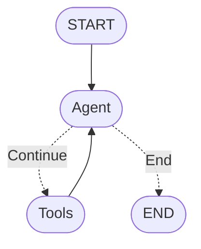

# AI Agent开发案例2 —— ReAct Agent

## 1. 目标

ReAct Agent的示意图：



1. Learn how to create Tools in LangGraph

2. How to create a ReAct Graph

3. Work with different types of Messages such as ToolMessages

4. Test out robustness of our graph

核心目标：

1. Create a robust ReAct Agent

## 2. 实现

```py
import os

from typing import Annotated, Sequence, TypedDict
from dotenv import load_dotenv

from langchain_core.messages import BaseMessage
from langchain_core.messages import ToolMessage
from langchain_core.messages import SystemMessage
from langchain_core.tools import tool

from langchain_openai import ChatOpenAI
from langgraph.graph.message import add_messages
from langgraph.graph import StateGraph, START, END
from langgraph.prebuilt import ToolNode

class AgentState(TypedDict):
    llm: ChatOpenAI
    messages: Annotated[Sequence[BaseMessage], add_messages]

@tool
def add(a: int, b: int):
    """This is an additional function that adds 2 numbers together"""
    return a + b

@tool
def sub(a: int, b: int):
    """This is an subtraction functon"""
    return a - b

@tool
def mul(a: int, b: int):
    """This is a multiplication function"""
    return a * b

tools = [add, sub, mul]

def model_call(state: AgentState) -> AgentState:
    system_prompt = SystemMessage(content="You are my AI assistant, please answer my query to the best of your ability.")
    response = state['llm'].invoke([system_prompt] + state['messages'])
    return {"messages": [response]}

def should_continue(state: AgentState):
    messages = state['messages']
    last_message = messages[-1]
    if not last_message.tool_calls:
        return "end"
    else:
        return "continue"

def print_stream(stream):
    for s in stream:
        message = s['messages'][-1]
        if isinstance(message, tuple):
            print(message)
        else:
            message.pretty_print()

if __name__ == '__main__':
    curr_dir = os.path.dirname(os.path.abspath(__file__))
    proj_dir = os.path.dirname(os.path.dirname(curr_dir))
    env_path = os.path.join(proj_dir, ".env")
    _ = load_dotenv(dotenv_path=env_path, override=True)

    llm = ChatOpenAI(
        model="gpt-4o",
        api_key=os.environ['OPENAI_API_KEY'],
        base_url=os.environ['OPENAI_API_BASE']
    ).bind_tools(tools)

    graph = StateGraph(AgentState)
    graph.add_node("agent", model_call)
    graph.add_edge(START, "agent")
    
    # 添加工具节点
    tool_node = ToolNode(tools=tools)
    graph.add_node("tools", tool_node)
    graph.add_conditional_edges(
        "agent",
        should_continue,
        {
            "continue": "tools",
            "end": END
        }
    )
    graph.add_edge("tools", "agent")

    app = graph.compile()

    inputs = {
        "llm": llm,
        # "messages": [("user", "40 + 3 * 4 - 5.")]
        # "messages": [("user", "Add 40 + 12 and then multiply the result by 6.")]
        "messages": [("user", "Add 40 + 12 and then multiply the result by 6. Also tell me a joke please")]
    }
    print_stream(app.stream(inputs, stream_mode="values"))
```
