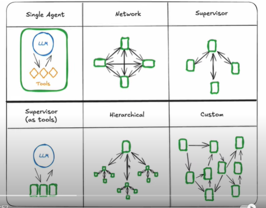

# 多Agent架构

## 1. 单Agent架构存在的问题

- agent has too many tools at its disposal and makes poor decisions about which tool to call next

- context grows too complex for a single agent to keep track of

- there is a need for multiple specialization areas in the system(e.g. planner, researcher, math expert, etc.) 

## 2. 多Agent架构的好处

### 多Agent架构

- **Single Agent**: An LLM that calls multiple tools

- **Network**: these agents each have their own individual tools and they communicate with each other by deciding who goes next.

对应Network架构的开发框架有swarm和crew AI.

- **Supervisor**: One single agent whose sole job is to route to other agents.

与Network架构相比，Supervisor架构使得下属的Agents更容易被管理和更加专注于自己的工作，因为下一步如何走是通过Supervisor agent来决定的。

- **Supervisor (with tools)**：One simplified version of Supervisor architecture. This is when you actually pass these sub agents as tools to the central supervisor LLM.

- **Hierarchical**: One supervisor agent which can call into a separate sub agent but that sub agent itself is a supervisor agent.

- **Custom**：Architecture athat custom to the domain that you're building

### 多Agent架构的好处

- 模块化: Separate agents make it easier to develop, test, and maintain agentic systems.

- 专业化: You can create expert agents focused on specific domains, which helps with the overall system performance.

- 可控性: You can explicitly control how agents communicate(as opposed to relying on function calling). 

## 3. 多Agent之间的通信
当Agent 1调用Agent 2时，Agent 2能看到什么？

- The two agents share some overall State object

- The second agent just gets the results of tool call from agent one

两个状态不同的Agent之间如何同步状态？一种方法是每个Agent的状态分为共有和私有两部分，共有部分每个Agent之间保持一致，私有部分各自可以不同。

