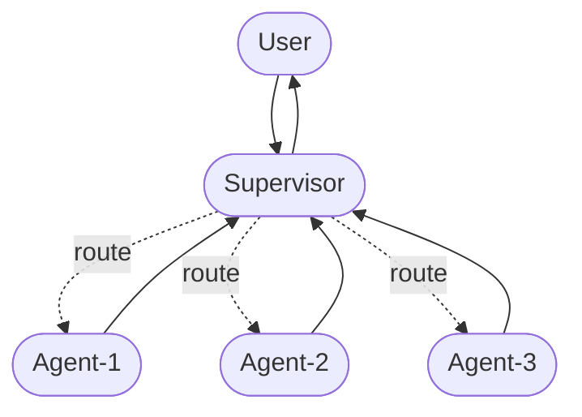

# Supervisor架构多Agent开发案例

## 1. 目标

Supervisor架构示意图如下：

案例目标：

1. Build a supervisor system with two agents:

- a research expert

- a math expert

2. Build specialized research and math agents

3. Build a supervisor for orchestrating them with the prebuild `langgraph-supervisor`.

4. Build a supervisor from scratch

5. Implement advanced task delegation

## 2. 实现

