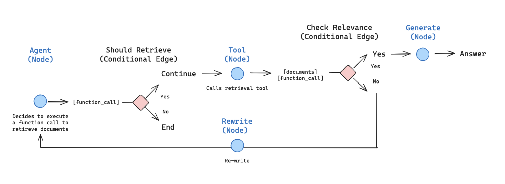

# Agentic RAG实现案例

## 1. 目标

1. Fetch and preprocess documents that will be used for retrieval.

2. Index those documents for semantic search and create a retriever tool for the agent.

3. Build an agentic RAG system that can decide when to use the retriever tool.

